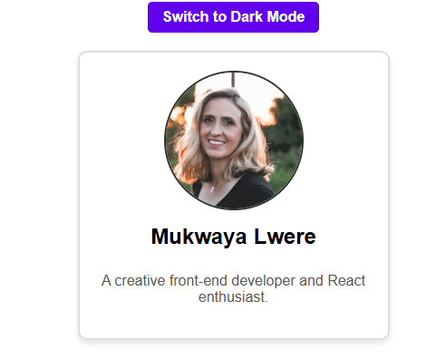
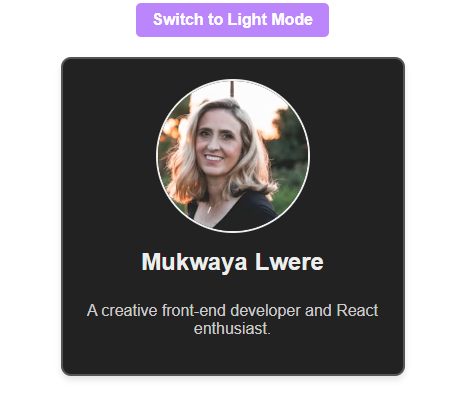

# Module 9B - Custom Profile Component

## Description
This is a Vite-built React application.  It has an inline CSS-styled profile component.  The application shows a simple user profile card with the user's name, a short bio, and a circular image.  In addition to a subtle hover effect on the profile card for enhanced interactivity, it has a dark mode toggle that allows users to switch between light and dark themes.  Name, bio, image URL, and contact information are all managed by the main app component and sent to child components as props for simple customization.
---

## What I Learned
- How to create React components with JSX.
- How to use component-scoped styling with inline CSS.
- How to use React to create and render functional components.
- Controlling component state for user interface elements such as hover effects and dark mode toggle.
- Children's components for modular and reusable design are being passed along.
- Enhancing screen reader support by incorporating accessibility features such as ARIA attributes.

---

## Challenges
Keeping styles scoped and manageable while maintaining consistent dark mode styling across components was one of the challenges I faced.  I fixed this by keeping the main app component (`App.jsx`) in a global dark mode state and passing it to child components as a prop.  This made it possible to apply dynamic inline styling according to the state of dark mode.  Applying CSS transitions within inline styles and using event handlers to toggle hover state solved another difficulty: creating fluid hover effects and transitions.

---

## Screenshot

